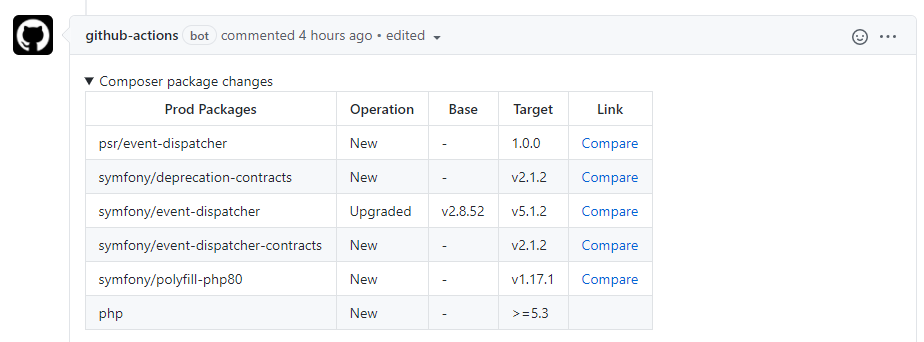

# Composer Diff action

This action compares your `composer.lock` files and generates human-readable report with packages changed in PR or commit using [composer-diff](https://github.com/IonBazan/composer-diff).
You may use the action output to annotate your code or add a comment to your Pull Request.

## Example

Here's an example of the Composer Diff Github Action providing feedback on a Pull Request:



_**Note:** you must use the actions/checkout step with `fetch-depth: 0` as shown below before running the Composer Diff action in order for it to function properly_
_You may set it to `1` if you want to compare only with the previous commit._

```yaml
name: Composer Diff
on:
  pull_request:
    paths:
      - 'composer.lock'
jobs:
  composer-diff:
    name: Composer Diff
    runs-on: ubuntu-latest
    steps:
      - name: Checkout
        uses: actions/checkout@v2
        with:
          fetch-depth: 0 # Required to make it possible to compare with PR base branch

      - name: Generate composer diff
        id: composer_diff # To reference the output in comment
        uses: IonBazan/composer-diff-action@v1

      - uses: marocchino/sticky-pull-request-comment@v2
        # An empty diff result will break this action.
        if: ${{ steps.composer_diff.outputs.composer_diff_exit_code != 0 }}
        with:
          header: composer-diff # Creates a collapsed comment with the report
          message: |
            <details>
            <summary>Composer package changes</summary>

            ${{ steps.composer_diff.outputs.composer_diff }}

            </details>
```

## Inputs

This action takes same input arguments as the [composer-diff command](https://github.com/IonBazan/composer-diff#usage):

- `base` - base (old) `composer.lock` path and/or git reference - default: `${{ github.event.pull_request.base.sha }}` (last commit in base branch of PR)

  To use it with custom `composer.lock` path, follow `commit_hash:path/to/composer.lock` convention.
- `target` - target (new) `composer.lock` path and/or git reference - default: `composer.lock` (current file version)

  Follows same convention as `base` argument
- `format` - output format - either `mdtable`, `mdlist` or `json` - see [composer-diff documentation](https://github.com/IonBazan/composer-diff#usage) - default: `mdtable`
- `strict` - returns non-zero exit code if there are any changes - default: `false`
- `no-dev` - excludes dev dependencies - default: `false`
- `no-prod` - excludes prod dependencies - default: `false`
- `with-platform` - include platform (`php`, `ext-*`) dependencies - default: `false`
- `with-links` - adds compare/release URLs - default: `false`
- `extra-arguments` - additional arguments to be passed to the command - default: `--ansi` (for colorful output)

## Outputs

This command produces an output named `composer_diff` containing the output of the command with stripped colors and prepared for processing further with other actions (creating a comment, annotation, etc.). 

Result of command is available as `composer_diff_exit_code`:

*  `0` - OK.
*  `1` - General error.
*  `2` - There were changes in prod packages.
*  `4` - There were changes is dev packages.
*  `8` - There were downgrades in prod packages.
* `16` - There were downgrades in dev packages.

You may reference it using:
```yaml
steps:
  - name: Generate composer diff
    id: composer_diff
    uses: IonBazan/composer-diff-action@v1
  - uses: foo/bar@v1
    with:
      diff: ${{ steps.composer_diff.outputs.composer_diff }}
```

## Usage with push or schedule triggered workflows

This action is intended to be used with Pull Requests, hence `base` defaults to `${{ github.event.pull_request.base.sha }} ` which produces an empty string for runs triggered without a PR. This may cause issues when running it in a workflow triggered with a push or cron, producing an empty diff as `composer-diff` will use same file for base and head (see https://github.com/IonBazan/composer-diff-action/issues/9). 

To prevent this from happening, set `base` parameter to `HEAD` (or any other git reference):

```yml
      - name: Generate composer diff
        id: composer_diff # To reference the output in comment
        uses: IonBazan/composer-diff-action@v1
        with: 
          base: HEAD
          no-dev: true
          format: mdlist
```
